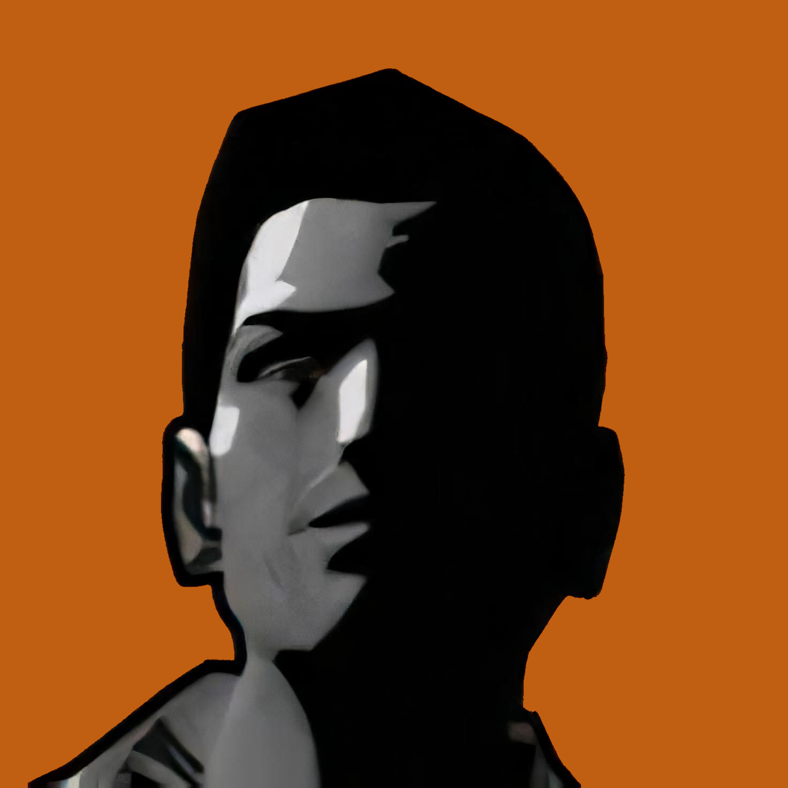

[![Issues][issues-shield]][issues-url]
[![MIT License][license-shield]][license-url]

<!-- PROJECT LOGO -->
 

  

  <h3 align="center">MTA Discord Rich Presence</h3>

  

    External Rich Presence Manager for Multi Theft Auto: San Andreas.
     
     
    <a href="https://github.com/pkfln/mta-discord-rpc/issues">Report an issue</a>
  

<!-- TABLE OF CONTENTS -->
## Table of Contents

* [Installation](#installation)
  * [Testing](#testing)
  * [Installing](#installing)
  * [Updating](#updating)
* [Why?](#why)
* [Adding server assets](#adding-server-assets)
* [Contributing](#contributing)
* [Known bugs](#known-bugs)
* [License](#license)

<!-- INSTALLATION -->
## Installation

### Testing

First make sure it works for you before you install it. **It's recommended to be on the latest Windows 10 Build (I haven't tested it on any other OS or earlier versions of Windows).**
1. Close your MTA:SA instance if you have it running.
2. Download the newest release from the <a href="https://github.com/pkfln/mta-discord-rpc/releases">releases page</a>.
3. Open the folder containing the downloaded executable.
4. Execute the file by double-clicking it.
5. If you're not getting any errors, try to open MTA:SA.
6. Check your Discord Rich Presence status and see, if it's setting your status.
6. If everything works so far, you're ready to install it. If you do get some errors, try to fix them or open a new issue.

### Installing

1. Press <kbd>Win</kbd> + <kbd>R</kbd>, you should then see the Run-tool.
2. Type in `shell:startup` and press <kbd>Enter</kbd>.
3. Either create a shortcut to the executable you just downloaded or move it into this new folder window.
4. Next time you login to your Windows, mta-discord-rpc will automatically start.

To uninstall it / disable it from the Windows startup, simply delete the downloaded executable or the shortcut you created.

### Updating
To update, just download the latest build from the <a href="https://github.com/pkfln/mta-discord-rpc/releases">releases page</a> and repeat the installation process.

<!-- WHY -->
## Why?

Since you can't really make clientsided modifications for MTA (or at least not that I know of), I decided to do it this way, so that it doesn't interfer with the actual process and is fully external. MTA had rich presence support in the past, but it got removed for some reason.

<!-- ADDING SERVER ASSETS -->
## Adding server assets

If you want your server logo to be shown on the rich presence instead of the default MTA logo, create a pull request with your server logo.
1. Fork this project
2. Create your branch (e.g. asset/my-server): `git checkout -b asset/my-server`
3. Add your server logo in the assets directory. Make sure your logo has a background and a minimum size of 512x512 (1024x1024 recommended). Only PNGs are currently supported. Name your file in the following format: `[ip]_[port].png` (no hostnames).
4. Stage your file: `git add assets/127.0.0.1_22003.png`
4. Commit your changes: `git commit -m 'Add server logo for Localhost'`
5. Push your new changes: `git push origin asset/my-server`
6. Open a Pull Request

<!-- CONTRIBUTING -->
## Contributing

Coming soon.

<!-- KNOWN BUGS -->
## Known bugs

- Directly connecting to another server while already being connected to one isn't picked up. (temp. fix: type `reconnect` in the MTA console)
- Having multiple Discord instances open won't display the rich presence

<!-- LICENSE -->
## License

Distributed under the MIT License. See `LICENSE` for more information.

<!-- MARKDOWN LINKS & IMAGES -->
<!-- https://www.markdownguide.org/basic-syntax/#reference-style-links -->
[contributors-shield]: https://img.shields.io/github/contributors/pkfln/mta-discord-rpc.svg?style=flat-square
[contributors-url]: https://github.com/pkfln/mta-discord-rpc/graphs/contributors
[forks-shield]: https://img.shields.io/github/forks/pkfln/mta-discord-rpc.svg?style=flat-square
[forks-url]: https://github.com/pkfln/mta-discord-rpc/network/members
[stars-shield]: https://img.shields.io/github/stars/pkfln/mta-discord-rpc.svg?style=flat-square
[stars-url]: https://github.com/pkfln/mta-discord-rpc/stargazers
[issues-shield]: https://img.shields.io/github/issues/pkfln/mta-discord-rpc.svg?style=flat-square
[issues-url]: https://github.com/pkfln/mta-discord-rpc/issues
[license-shield]: https://img.shields.io/github/license/pkfln/mta-discord-rpc.svg?style=flat-square
[license-url]: https://github.com/pkfln/mta-discord-rpc/blob/master/LICENSE
